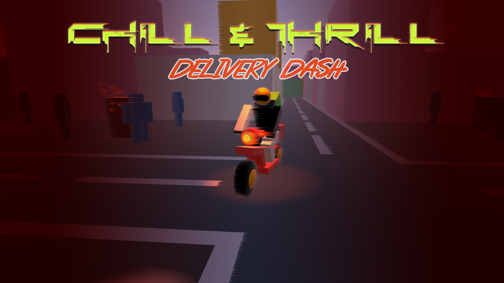

# Chill & Thrill: Delivery Dash

## Overview

"Chill & Thrill: Delivery Dash" is a cyberpunk delivery game set in a dystopian future where players must navigate an ever-changing city while managing extreme weather conditions. Make deliveries to earn points while strategically collecting items to survive harsh temperature changes.

## Play Online

Play the game directly in your browser: [https://chill-and-thrill.vercel.app](https://chill-and-thrill.vercel.app)

## Game Features

- **Dynamic Weather System**: Adapt to changing weather conditions that directly affect your character's body temperature
- **Strategic Risk-Reward Gameplay**: Balance quick deliveries for points against survival in extreme conditions
- **Isometric Cyberpunk World**: Explore a neon-lit dystopian cityscape with a distinctive low-poly art style
- **Survival Mechanics**: Collect emergency kits and items to maintain optimal body temperature
- **Progressive Difficulty**: Face increasingly challenging weather patterns as your score improves

## Controls

- **WASD**: Movement
- **Mouse**: Camera control
- **ESC**: Pause menu

## Development Team

- **Cosmin Vlasie**: Visual prototyping, UI design, level layout
- **Yue Wu**: Player movement systems, camera controls, delivery mechanics
- **Jedrzej Lewandowski**: Game mechanics, weather system, temperature logic
- **Ludovico Angelini**: Audio-visual aspects, day-night cycle, weather effects

## Asset sourcing

- All audio assets are royalty-free and were sourced(and in some cases edited) from: https://pixabay.com/
- Buildings prefabs are from the pack: https://kenney.nl/assets/city-kit-commercial
- Materials pack is from: https://assetstore.unity.com/packages/2d/textures-materials/cyberpunk-material-pack-six-high-quality-materials-188067
- Skybox asset: https://assetstore.unity.com/packages/2d/textures-materials/sky/skybox-series-free-103633?srsltid=AfmBOop8fMCVY8EEAkyyW99zTd0yFefvc_MpNyZN5kC9f5_nxlMlHtE4